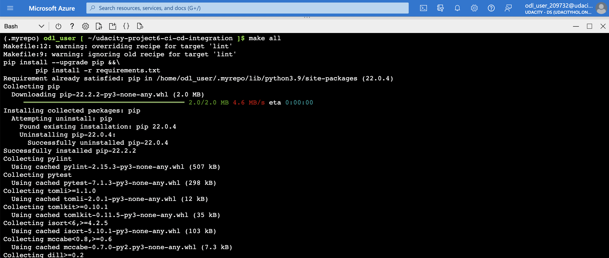
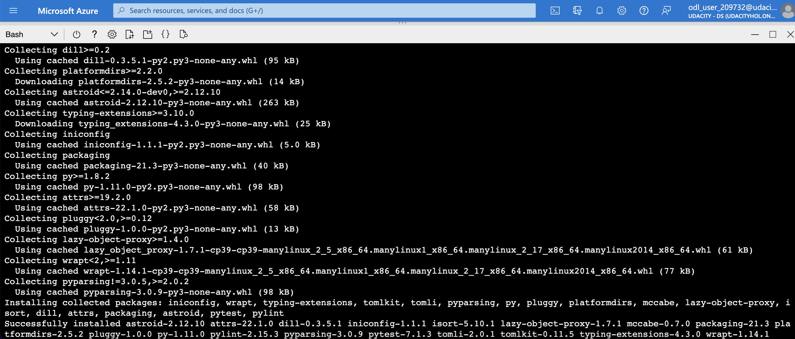

# Introduction

- In this project, build a Github repository from scratch and create a scaffolding that will assist you in performing both Continuous Integration and Continuous Delivery. You'll use Github Actions along with a Makefile, requirements.txt and application code to perform an initial lint, test, and install cycle. Next, you'll integrate this project with Azure Pipelines to enable Continuous Delivery to Azure App Service.

- This project will give you an opportunity to demonstrate your ability to perform continuous delivery for a Python-based machine learning application using the Flask web framework. You will apply the skills you have acquired in this course to operationalize a Machine Learning Microservice API.

- You are given a pre-trained, `sklearn` model that has been trained to predict housing prices in Boston according to several features, such as average rooms in a home and data about highway access, teacher-to-pupil ratios, and so on. If you're curious, you can read more about the data, which was initially taken from Kaggle, on the data source site. This project tests your ability to operationalize a Python flask app—in a provided file, app.py—that serves out predictions (inference) about housing prices through API calls. This project could be extended to any pre-trained machine learning model, such as those for image recognition and data labeling.

## Architectural Diagram

## Instructions for running the Python project

## Continuous Integration

### Clone and build an application inside of Azure Cloud Shell

- Project cloned into Azure Cloud Shell Screenshot

- Passing tests that are displayed after running the make all command from the Makefile

### Conduct a test run on an application in Azure Cloud Shell

### GitHub Actions to test and lint a project while writing code

## Continuous Delivery

### Load test an application using Locust

### Deploy an application using Azure Pipelines into Azure App Services

### Use the Azure CLI to deploy and manage an application

### Test an application inside of Azure Pipelines

## Project board

- [Trelo Project Template] (<https://trello.com/b/z7Qr8kou/building-a-ci-cd-pipeline>)
- [Google Sheet Template] (<https://docs.google.com/spreadsheets/d/1iEAlGO69lBFIAO4xn7zCAdrov9rtXBL7BNHWTJbOTqk/edit?usp=sharing>)

## Video URL

## Future Enhancement

## Environment

- Python 3.9.14
- Azure Cloud Shell
- Azure Web App
- Azure Devops
